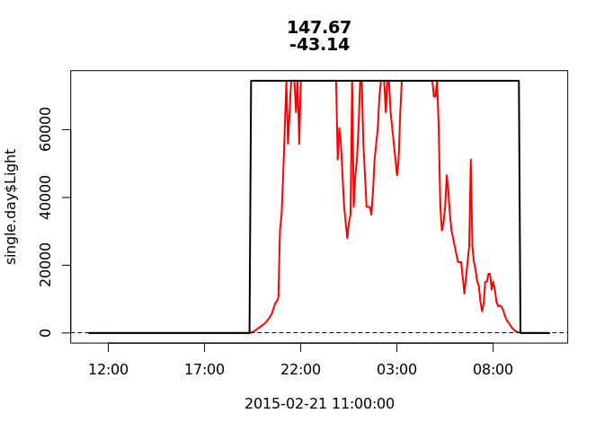
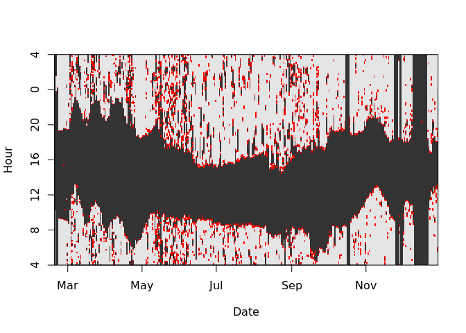
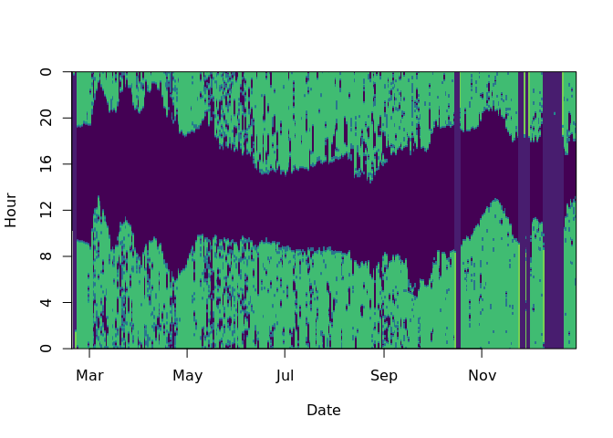
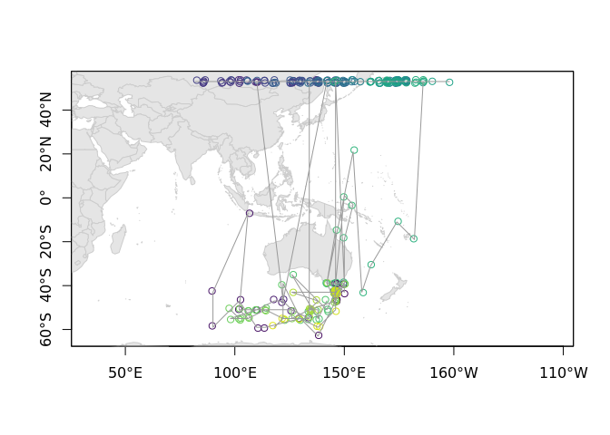
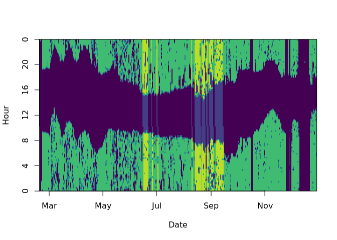
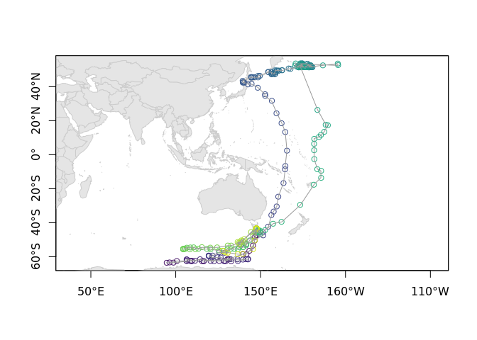

workflow for stsh
================
Bindoff, A.
25-9-2018

Read lux data in and make Date and Light columns in correct formats

``` r
d <- read_delim("690__WI_FEB2015driftadj.lux", delim = "\t", skip = 19)
names(d) <- c("Date", "Light")
d$Date <- ymd_hms(dmy_hms(d$Date, tz = "UTC"))
d$Temp <- NA  # have to supply a Temp column to TwilightFree
d <- numberDays(d) # need Day_num column for some TwilightFree functions
head(d, n = 3);tail(d, n = 3)
```

    ## # A tibble: 3 x 4
    ##   Date                Light Temp  Day_num
    ##   <dttm>              <dbl> <lgl>   <int>
    ## 1 2015-02-18 10:15:11  36.3 NA          0
    ## 2 2015-02-18 10:20:11  36.3 NA          0
    ## 3 2015-02-18 10:25:11  37.5 NA          0

    ## # A tibble: 3 x 4
    ##   Date                Light Temp  Day_num
    ##   <dttm>              <dbl> <lgl>   <int>
    ## 1 2016-10-24 10:30:54  13.6 NA        614
    ## 2 2016-10-24 10:35:54  13.6 NA        614
    ## 3 2016-10-24 10:40:54  13.6 NA        614

Make (coarse) grid and supply colony location for a quick first-pass

``` r
retrieved.at <- deployed.at <- c(147.67, -43.133) # Wedge Island

grid <- makeGrid(c(40, 220), c(-65, 55),
                 cell.size = 4, mask = "sea", pacific = TRUE)
```

Determine a threshold from a (known) location and (assumed) zenith

``` r
thresh <- calibrate(d, as.POSIXct("2015-02-21 11:00:00"), 147.67, -43.14, zenith = 94)*1.07
```

    ## Warning in calibrate(d, as.POSIXct("2015-02-21 11:00:00"), 147.67,
    ## -43.14, : It looks like your data may not be in BAS tag format. You may
    ## need to transform before determining a threshold.



    ## [1] "max light in night window: 91.98 assuming a solar zenith angle of: 94"

Subset the first year of data to more easily remove non-solar light using eraseLight() (which allows you to mark bottom-left and top-right corners of a box bounding non-solar light to delete those observations), and thresholdPlot() (which plots where light crosses threshold)

``` r
d <- dplyr::filter(d, Date < "2015-12-30", Date > "2015-02-18")
```

``` r
thresholdPlot(d, thresh, offset = 4)
```



``` r
# run the following line directly from console to erase non-solar light
# d <- eraseLight(d, thresh, offset = 4)
```

Find days at colony

``` r
colony <- findColony(d, thresh, deployed.at, q = 0.9)
missingPlot(d, threshold = thresh, fixd = colony)
```



Specify a model and fit it

``` r
model <- TwilightFree(d,
                      alpha = c(1, .08),
                      beta = c(1, 0.2),
                      zenith = 94, threshold = thresh, 
                      fixd = colony)
# fit the model using the forward-backward algorithm, SGAT::essie
fit <- SGAT::essie(model, grid, epsilon1=1.0E-4, epsilon2 = 1E-4)
```

It will look terrible and there will be lots of warnings, don't panic.

``` r
drawTracks(trip(fit))
```

    ## Warning in trip(fit): 
    ## Day c(117, 118, 119, 120, 121, 122, 127, 133, 172, 176, 177, 178, 179, 180, 181, 182, 184, 185, 186, 187, 189, 190, 192, 193, 194, 195, 196, 199, 200, 201, 202, 203, 204, 205, 206, 207) missing, could not estimate location.



We can have a look at which days went wrong specifically (highlighted), then either use `eraseLight()` and fix up obvious non-solar light and repeat the above fit, or remove the bad days entirely (shown below)

``` r
missingPlot(d, fit, threshold = thresh)
```



We can remove all of these days easily -

``` r
d <- removeMissing(d, fit)
```

(But if you'd noticed there was non-solar light on any of them, better to use `eraseLight` and run it again before resorting to the above)

Now we can fit the track again (this time we'll provide a finer grid because hopefully this one will be a keeper)

``` r
grid <- makeGrid(c(40, 220), c(-65, 55),
                 cell.size = 1, mask = "sea", pacific = TRUE)

model <- TwilightFree(d,
                      alpha = c(1, .08),
                      beta = c(1, 0.2),
                      zenith = 94, threshold = thresh, 
                      fixd = colony)
# fit the model using the forward-backward algorithm, SGAT::essie
fit <- SGAT::essie(model, grid, epsilon1=1.0E-16, epsilon2 = 1E-16)

track <- trip(fit)
drawTracks(track)
```


